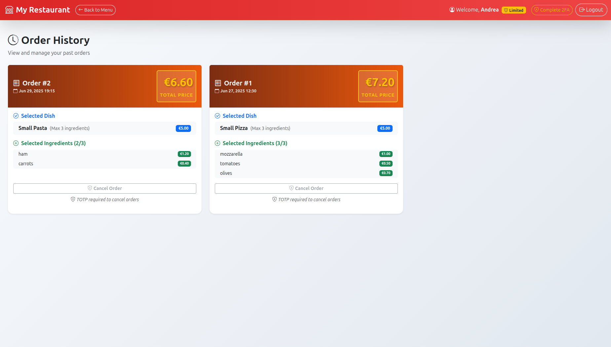

# Exam #2: "Restaurant"
## Student: s347291 BOTTICELLA ANDREA 

## 1. Server-side

### API Server

#### Authentication APIs
- `POST /api/sessions` - User login. Body: `{username, password}`. Returns user info with isTotp flag.
- `POST /api/login-totp` - TOTP verification for 2FA. Body: `{token}`. Returns success confirmation.
- `DELETE /api/sessions/current` - User logout. Returns 204.
- `GET /api/sessions/current` - Get current user session information.

#### Dishes APIs
- `GET /api/dishes` - Get all base dishes with sizes and prices (public access).

#### Ingredients APIs
- `GET /api/ingredients` - Get all ingredients with prices, availability, dependencies, incompatibilities (public access).

#### Orders APIs
- `POST /api/orders` - Create new order (auth required). Body: `{dish_name, dish_size, ingredients[], total_price}`.
- `GET /api/orders` - Get user's order history (auth required).
- `DELETE /api/orders/:id` - Cancel order (requires TOTP authentication).

### Database Tables

- **users**: id (PK), email (unique), name, hash, salt, otp_secret
- **dishes**: id (PK), name, size, price, max_ingredients
- **ingredients**: id (PK), name, price, availability, current_availability
- **ingredient_dependencies**: ingredient_id (FK), required_ingredient_id (FK)
- **ingredient_incompatibilities**: ingredient1_id (FK), ingredient2_id (FK)
- **orders**: id (PK), user_id (FK), dish_name, dish_size, total_price, order_date
- **order_ingredients**: order_id (FK), ingredient_id (FK) [composite PK]

## 2. Client-side

### Application Routes

- `/` - Main restaurant page with menu browsing and order configuration.
- `/login` - Authentication page with username/password login.
- `/totp` - Two-factor authentication page for completing 2FA.
- `/orders` - Order history page showing past orders with detailed view.

### Main React Components

- `App` - Root component managing authentication state and routing.
- `RestaurantLayout` - Main layout with navigation and content areas.
- `LoginLayout` - Authentication page with login form and TOTP verification.
- `NavigationBar` - Top navigation with user info and authentication controls.
- `DishList` - Component for browsing and selecting base dishes and sizes.
- `IngredientList` - Component for browsing and selecting ingredients with constraints.
- `OrderConfigurator` - Component for configuring orders and showing total price.
- `OrderHistory` - Component for displaying past orders with cancellation option.
- `LoginForm` - Authentication form with TOTP support.

## 3. Overall

### Screenshots

#### Login Page

#### Homepage (Unauthenticated User)

#### Order Configuration Page

#### TOTP Authentication Page

#### Order History Page

#### User Without 2FA Access

### User Credentials

#### Regular Users
- **Email**: `a@test.com` | **Password**: `pwd`
- **Email**: `r@test.com` | **Password**: `pwd`
- **Email**: `e@test.com` | **Password**: `pwd`
- **Email**: `s@test.com` | **Password**: `pwd`

**Note**: All users have TOTP enabled. Users can login without 2FA but will have limited access. Order cancellation requires TOTP verification using secret: LXBSMDTMSP2I5XFXIYRGFVWSFI`

