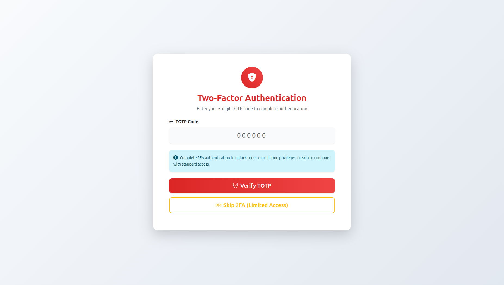

# Exam #2: "Restaurant"
## Student: s347291 BOTTICELLA ANDREA 

## React Client Application Routes

- Route `/`: Main restaurant page with menu browsing and order configuration. Users can browse dishes and ingredients (public), authenticated users can create orders.
- Route `/login`: Authentication page with username/password login and TOTP verification support.
- Route `/totp`: Two-factor authentication page for completing 2FA with TOTP code input.
- Route `/orders`: Order history page showing past orders with detailed view and cancellation option (requires authentication).

## API Server

- POST `/api/sessions`
  - request body: `{username, password}`
  - response body: user info with isTotp flag
- POST `/api/login-totp`
  - request body: `{token}` (TOTP code)
  - response body: success confirmation
- DELETE `/api/sessions/current`
  - request parameters: none
  - response: 204 status code
- GET `/api/sessions/current`
  - request parameters: none
  - response body: current user session information
- GET `/api/dishes`
  - request parameters: none
  - response body: array of all base dishes with sizes and prices (public access)
- GET `/api/ingredients`
  - request parameters: none
  - response body: array of all ingredients with prices, availability, dependencies, incompatibilities (public access)
- POST `/api/orders`
  - request body: `{dish_name, dish_size, ingredients[], total_price}`
  - response body: created order confirmation (auth required)
- GET `/api/orders`
  - request parameters: none
  - response body: array of user's order history (auth required)
- DELETE `/api/orders/:id`
  - request parameters: order id in URL path
  - response body: cancellation confirmation (requires TOTP authentication)

## Database Tables

- Table `users` - contains id, email, name, hash, salt, otp_secret for user authentication and 2FA
- Table `dishes` - contains id, name, size, price, max_ingredients for base dish definitions
- Table `ingredients` - contains id, name, price, availability, current_availability for ingredient catalog
- Table `ingredient_dependencies` - contains ingredient_id, required_ingredient_id for ingredient requirements
- Table `ingredient_incompatibilities` - contains ingredient1_id, ingredient2_id for mutual incompatibilities
- Table `orders` - contains id, user_id, dish_name, dish_size, total_price, order_date for order records
- Table `order_ingredients` - contains order_id, ingredient_id for many-to-many order-ingredient relationships

## Main React Components

- `App` (in `App.jsx`): Root component managing global authentication state, routing, and message system
- `RestaurantLayout` (in `Layout.jsx`): Main layout component with navigation and content areas for the restaurant interface
- `LoginLayout` (in `Layout.jsx`): Authentication page layout handling login form and TOTP verification
- `NavigationBar` (in `NavigationBar.jsx`): Top navigation with user info, authentication controls, and 2FA status
- `DishList` (in `DishList.jsx`): Component for browsing and selecting base dishes with two-step selection (type and size)
- `IngredientList` (in `IngredientList.jsx`): Component for browsing and selecting ingredients with constraint validation
- `OrderConfigurator` (in `OrderConfigurator.jsx`): Dual-mode component for configuring new orders and displaying order details
- `OrderHistory` (in `OrderHistory.jsx`): Component displaying past orders with detailed view and cancellation functionality
- `LoginForm` (in `LoginForm.jsx`): Authentication form with dual-mode support for login and TOTP verification

### Screenshots

#### Homepage (Unauthenticated User)

#### Login Page

#### TOTP Authentication Page

#### Order Configuration Page

#### Order History Page

#### User Without 2FA Access

## Users Credentials

- a@test.com, pwd (TOTP secret: LXBSMDTMSP2I5XFXIYRGFVWSFI)
- r@test.com, pwd (TOTP secret: LXBSMDTMSP2I5XFXIYRGFVWSFI)
- e@test.com, pwd (TOTP secret: LXBSMDTMSP2I5XFXIYRGFVWSFI)
- s@test.com, pwd (TOTP secret: LXBSMDTMSP2I5XFXIYRGFVWSFI)

**Note**: All users have TOTP enabled. Users can login without 2FA but will have limited access. Order cancellation requires TOTP verification.

